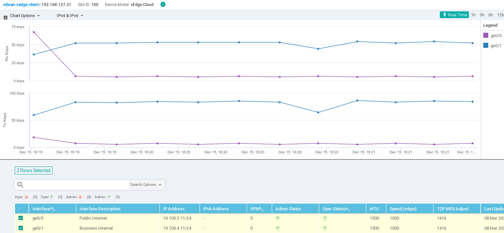
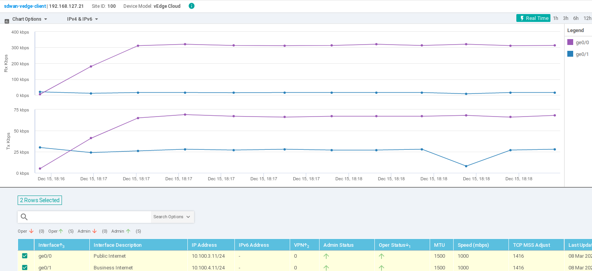

# SD-WAN aware L7 traffic management

## User Story

Same scenario as [Service-level SD-WAN policies](../01-service-level_SD-WAN_policies/README.md), but now only GET queries to the http://payment.secure:8080/payment API endpoint are considered sensitive, access to http://payment.secure:8080/stats is irrelevant (defaults to the Internet), and any other access to the service is denied.

## Setup

We have two k8s clusters interconnected with SD-WAN.

The SD-WAN is configured with two SLA class: *Business Internet* (fastest and most secure) and *Public Internet* (best-effort).

The clusters are installed with k8s (v1.25) and Istio (v1.16.0).

```
  +------------SD-WAN-------------+
  |  vEdge ------------- vEdge    |
  +----+-------------------+------+
       |                   |
 +-----+------+      +-----+------+
 |  cluster1  |      |  cluster2  |
 |    k8s     |      |    k8s     |
 +------------+      +------------+
```

## Steps

### Install

0. Follow installation steps of the [Service-level SD-WAN policies](../01-service-level_SD-WAN_policies/README.md) demo.

1. Apply client side L7 traffic routing on **cluster1** with [yaml/5-client-side-l7-policy-gw.yaml](yaml/5-client-side-l7-policy-gw.yaml). The HTTPRoute configuration is set to route payment service traffic to path `/anything` over the *Business Internet*, other HTTP traffic of the payment service (*e.g.*, no path specified) goes on *Public Internet*.

```console
kubectl apply -f yaml/5-client-side-l7-policy.yaml
```

### Test and Demo

2. Send a request to service running in cluster2 from the client (`net-debug` pod) in **cluster1**:

- With no HTTP path specified:
 ```console
kubectl exec -it $(kubectl get pods -o custom-columns=":metadata.name" | grep net-debug-nonhost) -- curl -X GET -v -I -H "Host: payment.default.svc.clusterset.local" http://payment-egress:8000
```
- To `/anything`:
 ```console
kubectl exec -it $(kubectl get pods -o custom-columns=":metadata.name" | grep net-debug-nonhost) -- curl -X GET -v -I -H "Host: payment.default.svc.clusterset.local" http://payment-egress:8000/anything
```

3. Do a volumetric measurement to check proper configuration:

- Generate test traffic on *cluster1*:
```console
while [ true ]; do kubectl exec -it $(kubectl get pods -o custom-columns=":metadata.name" | grep net-debug-nonhost) -- curl -X GET -sS -H "Host: payment.default.svc.clusterset.local" http://payment-egress:8000/anything -o /dev/null ; done
```

- Observe metrics on the vManage UI:
Navigate to *Monitor/Network*, and select a vEdge instance. Click on *Interface*, then select *Real Time* over the graph.

In case of `/anything`, We expect to see traffic on *Business Internet*.



For `payment-insecure`, repeat these steps, but generate traffic as:
```console
while [ true ]; do kubectl exec -it $(kubectl get pods -o custom-columns=":metadata.name" | grep net-debug-nonhost) -- curl -X GET -sS -H "Host: payment.default.svc.clusterset.local" http://payment-egress:8000 -o /dev/null ; done
```

This time the traffic goes on *Public Internet*.


